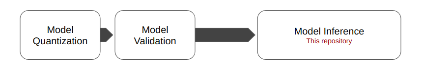

<div align="center">
    
</div>

This repository is the second part of **Optimization of Object Detection on LattePanda 3 Delta**. The first part can be found [here](https://github.com/arshemii/detection_quantization).
<div align="center">
    
</div>

This repository presents a complete, flexible, and ready-to-use application to infere object detection models on CPU-based edge devices. The inference, preprocessing, and postprocessing is optimized and tested on LattePanda 3 Delta. In details, 6 different Object Detection models (**YOLOv5nu, YOLOv8n, YOLO11n, CenterNet, DETR, and EfficientDet, all trained on Coco2017**) are selected, quantized, and validated in [this repository](https://github.com/arshemii/detection_quantization). You can inspect more about these models in:

- [&nbsp;YOLOv5 Documentation](https://docs.ultralytics.com/yolov5/)
- [&nbsp;YOLOv8 Documentation](https://docs.ultralytics.com/models/yolov8/)
- [&nbsp;YOLOv11 Documentation](https://docs.ultralytics.com/models/yolo11/)
- [&nbsp;CenterNet Paper](https://arxiv.org/abs/2005.12872)
- [&nbsp;DETR Paper](https://arxiv.org/abs/1904.07850)
- [&nbsp;EfficientDet GitHub Repository](https://github.com/google/automl/tree/master/efficientdet)


## Specifications:
- &nbsp;&nbsp; Capture frames from Webcam and RGB-D device (Intel RealSense D435)
- &nbsp;&nbsp; Data sctructure and types are Numpy f32 since the test hardware has Intel® SSE4.2
- &nbsp;&nbsp; Input size flexibility due to dynamic size input layer for all models
- &nbsp;&nbsp; Use OpenVino runtime for inference (Asynchronous inference)
- &nbsp;&nbsp; 3 different heads for RGB-D: Textual Report, Stream Visualization, and a Top-view B&W Map
- &nbsp;&nbsp; 2 different heads for RGB: Textual Report and Stream Visualization

### If you want to integrate this repository into your ROS application, check ROS branch of this repository:
- [&nbsp;ROS integration](https://github.com/arshemii/detection_on_cpu/tree/ROS)

----------------------------------------------------------------
## How to use:
&nbsp;&nbsp; 1. you should have installed OpenCV, OpenVino runtime, pyrealsense2, scipy, and numpy. <br>
&nbsp;&nbsp;&nbsp;&nbsp;&nbsp;&nbsp; It is better to install pyrealsense2 on python not newer than 3.11 <br>
&nbsp;&nbsp; 1.1. You can also pull the docker image, go to the folder detection_on_cpu, and continue from step 4:<br>
```markdown
docker pull arshemii/drone_od:04jan25
```
&nbsp;&nbsp;&nbsp;&nbsp;&nbsp;&nbsp; Then, start a container with:
```markdown
xhost +local:docker


docker run -it --privileged --rm \
  --user root \
  --device /dev/video0:/dev/video0 \
  --device /dev/video0:/dev/video1 \
  --device /dev/video0:/dev/video2 \
  --device /dev/video0:/dev/video3 \
  --device /dev/video0:/dev/video4 \
  --device /dev/video0:/dev/video5 \
  --device /dev/video0:/dev/video6 \
  --device /dev/video0:/dev/video7 \
  -e QT_QPA_PLATFORM=xcb \
  -v /tmp/.X11-unix:/tmp/.X11-unix -e DISPLAY=$DISPLAY \
  --cpus="1.0" \
  --memory="1g" \
  arshemii/drone_od:04jan25


# Change devices according to your video device
# Change cpu and memory limitation according to your hardware
# The first command is necessary to grant access to xcb to containers
```
&nbsp;&nbsp; 1.2. if you use a docker image, to have the latest version, do the following in each start-up:
```markdown
rmdir detection_on_cpu
git clone https://github.com/arshemii/detection_on_cpu.git
```
&nbsp;&nbsp; 2. Clone this repository and cd detection_on_cpu <br>
&nbsp;&nbsp; 3. Open a terminal and run: <br>
```markdown
cd path/to/cloned/repo
```
&nbsp;&nbsp; 4. Run inside the terminal:
```markdown
python3 inference_main.py --model effdet --device webcam --head vis --conf 0.99 --iou 0.3

# --model choices: ['yolov5nu', 'yolov8n', 'yolo11n', 'ctdet', 'detr', 'effdet']
# -- device choices: ['webcam', 'rgbd']
# -- head choices: ['text', 'vis', 'map'] map is available only for rgbd

```
&nbsp;&nbsp; 5. For testing the time for each inference part, run inside the terminal:
```markdown
python3 inference_test.py --model effdet --device webcam --head vis

# --model choices: ['yolov5nu', 'yolov8n', 'yolo11n', 'ctdet', 'detr', 'effdet']
# -- device choices: ['webcam', 'rgbd']
# -- head choices: ['text', 'vis', 'map'] map is available only for rgbd
```

&nbsp;&nbsp; 5. For testing on a recorded bag file (raw), run inside the terminal:
```markdown
python3 inference_bag.py --model effdet --head map --conf 0.99 --iou 0.3

# --model choices: ['yolov5nu', 'yolov8n', 'yolo11n', 'ctdet', 'detr', 'effdet']
# -- head choices: ['text', 'vis', 'map'] map is available only for rgbd
```

## References:
- https://docs.openvino.ai/2024/index.html
- https://docs.ultralytics.com
- https://github.com/google/automl/tree/master/efficientdet
- https://github.com/xingyizhou/CenterNet
- https://github.com/facebookresearch/detr

## Contact:
- [&nbsp;Email](arshemii1373@gmail.com)
