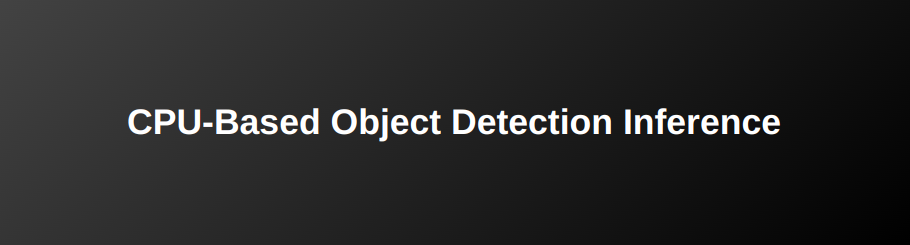

    

This repository is the second part of **Optimization of Object Detection on LattePanda 3 Delta**. The first part can be found [here](https://github.com/arshemii/detection_quantization).

    

This repository presents a complete, flexible, and ready-to-use application to infere object detection models on CPU-based edge devices. The inference, preprocessing, and postprocessing is optimized and tested on LattePanda 3 Delta. In details, 6 different Object Detection models (**YOLOv5nu, YOLOv8n, YOLO11n, CenterNet, DETR, and EfficientDet**) are selected, quantized, and validated in [this repository](https://github.com/arshemii/detection_quantization). You can inspect more about these models in:

- [&nbsp;YOLOv5 Documentation](https://docs.ultralytics.com/yolov5/)
- [&nbsp;YOLOv8 Documentation](https://docs.ultralytics.com/models/yolov8/)
- [&nbsp;YOLOv11 Documentation](https://docs.ultralytics.com/models/yolo11/)
- [&nbsp;CenterNet Paper](https://arxiv.org/abs/2005.12872)
- [&nbsp;DETR Paper](https://arxiv.org/abs/1904.07850)
- [&nbsp;EfficientDet GitHub Repository](https://github.com/google/automl/tree/master/efficientdet)

